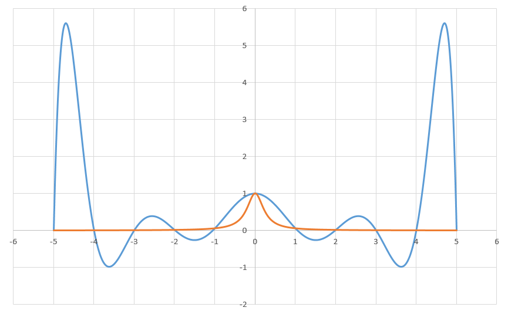
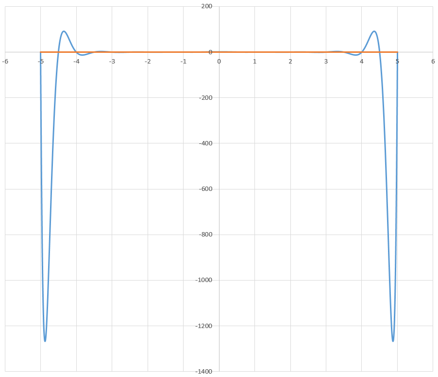
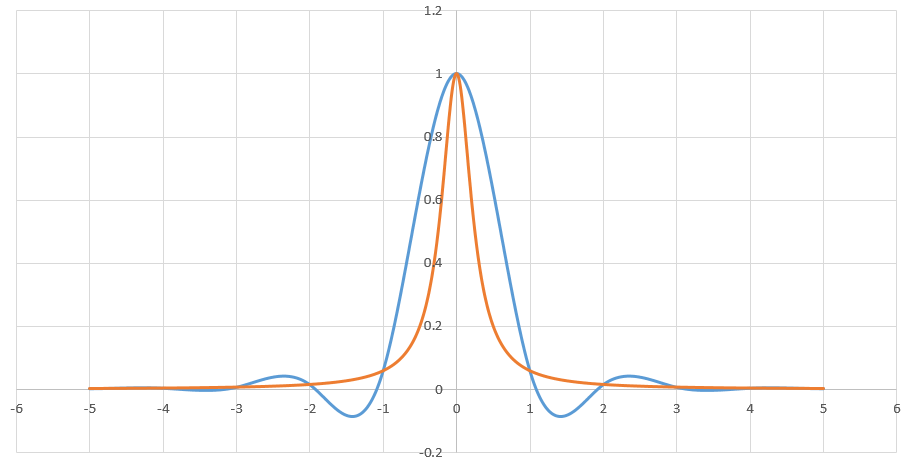
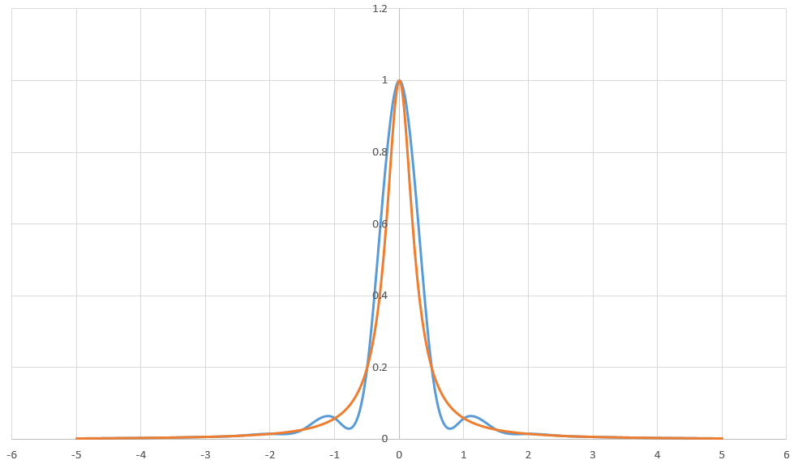

#  实验1 误差与插值法

## 题目1

###  实验要求

### 算法描述

从0开始不断循环计算部分和$x_n$，直到部分和与“准确值”偏差的绝对值小于指定值$\varepsilon$。循环途中记录循环次数$n$。

### 程序清单

* `error.cpp`：主要实验代码

### 运行结果

完整输出结果请见`error.txt`。

*实验值*

使用`float`类型计算，直到$n=9013$时，才有第一次$|x_n - \ln 2| \lt\varepsilon$。

*理论值*

由于有估计式，

$$|x_n - \ln 2| \lt \frac{1}{n + 1}$$

为了使得，

$$|x_n - \ln 2| \lt \varepsilon$$

可以令，

$$\frac{1}{n + 1} \lt \varepsilon$$

于是，

$$n \gt \frac{1}{\varepsilon} - 1 = 19999$$

得到

$$n \ge 20000$$

*讨论*

实验值要比理论值小，这可能是由于计算理论值所使用的估计式给出的误差限太松（大）。也就是说，$|x_n - \ln 2|$实际上比$\frac{1}{n + 1}$要“小得多”。

此外，我还尝试使用`double`计算，得到$n=9999$，所以另一个原因可能是，用`float`计算的误差反而导致计算结果提前与“准确值”偏差的绝对值小于$\varepsilon$。

### 体会与展望

从C++的角度来看，这个实验的代码十分简单；但是从《数值分析》的角度看，这个题目体现出了误差的概念，这一概念是该课程的核心概念之一。以此作为《数值分析》实验的开始，希望之后的实验不但能使我加深对本课程理论知识的理解，而且能锻炼我使用C++实际编写数值计算程序的能力。

## 题目2

### 实验要求

### 算法描述

#### 主程序

分别取$n=10, 20$进行如下步骤：

1. 使用题中函数$f(x)$，按照题目要求采样，得到$n + 1$个采样点，包括自变量值$x$和函数值$y$，存于`samples`中。
2. 用`samples`构造Lagrange插值对象`la`。
3. 由于插值函数`la`解析表达式十分复杂，所以不输出其表达式，而是对其进行精细的采样，输出插值函数的自变量值和函数值，用于下一步绘制函数图像。
4. 用`samples`、$f'(samples[0].x)$以及$f'(samples[n].x)$构造第一类边界条件的三次样条插值对象`sp`。其中，$f'(x)=-\frac{32x}{(1+16x^2)^2}$
5. 由于插值函数`sp`解析表达式十分复杂，所以不输出其表达式，而是对其进行精细的采样，输出插值函数的自变量值和函数值，用于下一步绘制函数图像。
6. 输出两插值函数以及$f(x)$在$x=4.8$处取值，以及插值函数与$f(x)$的误差。

#### Lagrange插值对象

插值对象是一个函数对象，被调用时使用参数`x`，利用如下Lagrange插值公式，现场计算插值函数在这一点的值：

$$ L(x) = \sum_{i = 0}^n y_i\Pi_{j = 0 且 j \ne i}^n \frac{x - x_j}{x_i - x_j} $$

式中，$x_i$为`samples[i].x`，$y_i$为`samples[i].y`。

观察发现可以缓存$c_i = \Pi_{j = 0 且 j \ne i}^n (x_i - x_j), i = 0, 1, \dots, n$来加快计算：

$$ L(x) = \sum_{i = 0}^n y_i \frac{\Pi_{j = 0 且 j \ne i}^n (x - x_j)}{c_i} $$

#### 第一类边界条件的三次样条插值对象

为构造此插值对象，首先构造三弯矩方程：
$$
A=\left[
\begin{matrix}
   b_0 & c_0 & & &  \\
   a_1 & b_1 & c_1 & & \\
    & \ddots  &  \ddots &  \ddots & \\
   & & a_{n-1} & b_{n-1} & c_{n-1}   \\
   & & & a_n & b_n
  \end{matrix}
  \right]
,~
  \mathbf{b}=\left[
\begin{matrix}
  f_0 & f_1 & \dots & f_{n-1} & f_n
  \end{matrix}
  \right]^T
 \\
 A\mathbf{x}=\mathbf{b}
$$
其中，
$$
a_i = \frac{h_{i - 1}}{h_{i - 1} + h_i}, i=1, 2, \dots, n-1 \\
b_i = 2, i=0, 1, \dots, n \\
c_i = \frac{h_i}{h_{i - 1} + h_i}, i=1, 2, \dots, n-1 \\
f_i = 6\frac{\frac{y_{i+1} - y_i}{x_{i+1} - x_i} - \frac{y_i - y_{i-1}}{x_i - x_{i-1}}}{h_{i - 1} + h_i}, i=1, 2, \dots, n-1 \\
$$
对于第一类边界条件，还有，
$$
a_n = c_0 = 1\\
f_0 = 6\frac{\frac{y_1-y_0}{x_1-x_0} - f'(x_0)}{x_1 - x_0} \\
f_n = 6\frac{f'(x_n) - \frac{y_n-y_{n-1}}{x_n-x_{n-1}}}{x_n - x_{n-1}}
$$
然后利用追赶法解出$\mathbf{x} = [M_i]^T$，并暂存。

计算出$M_i$后，每次该插值对象被调用时，就可以使用参数`x`，利用如下公式，计算出这一点插值函数的值：

$$ S(x) = \frac{M_i}{6h_i} (x_{i+1} - x)^3 + \frac{M_{i+1}}{6h_i} (x - x_i)^3 + \frac{y_i - \frac{M_i h_i^2}{6}}{h_i}(x_{i+1} - x) + \frac{y_{i+1} - \frac{M_{i+1} h_i^2}{6}}{h_i} (x - x_i) $$

上面各式中，$x_i$为`samples[i].x`，$y_i$为`samples[i].y`， $h_i = x_{i + 1} - x_i$。

#### 追赶法解三弯矩方程

依次迭代计算如下值，就可以得到方程的解$\mathbf{x}=[M_i]^T$。算法复杂度为$\Theta(n)$，$n+1$为矩阵阶数。
$$
\beta_0 = \frac{c_0}{b_0} \\
\beta_i = \frac{c_i}{b_i - a_i\beta_{i-1}}, i = 1, 2, \dots, n \\
y_0 = \frac{f_0}{b_0} \\
y_i = \frac{f_i - a_iy_{i - 1}}{b_i - a_i\beta_{i - 1}}, i = 1, 2, \dots, n \\
M_n = y_n \\
M_i = y_i - \beta_i M_{i + 1}, i = n - 1, n - 2, \dots, 0
$$
在实现时，我将$y_i$和$M_i$用同一个变量存储，节约内存空间。

### 程序清单

- `interpolation.cpp`：主要实验代码

### 运行结果

详细输出请见`10.txt`以及`20.txt`。

将算法输出结果用其他软件转换为图线，如图所示。

*n=10，Lagrange*

图中，蓝色曲线为插值函数，橙色曲线为$f(x)$。

*n=20，Lagrange*

图中，蓝色曲线为插值函数，橙色曲线为$f(x)$。

*n=10，三次样条*

图中，蓝色曲线为插值函数，橙色曲线为$f(x)$。

*n=20，三次样条*

图中，蓝色曲线为插值函数，橙色曲线为$f(x)$。

插值得到的函数图形与教材以及课程上的讲解一致。特别地，Lagrange高次插值能观察到明显的Runge现象，在边界处，比如$x=4.8$时，Lagrange插值有巨大误差。具体而言，$n=10$时，Lagrange插值在$x=4.8$的误差达到了$5.1486$，而三次样条插值误差只有$3.9244 \times 10^{-4}$；$n=20$时，Lagrange插值在$x=4.8$的误差更是达到了$1080.7$，而三次样条插值误差只有$1.1027 \times 10^{-6}$。这表明，节点数越多，Lagrange在边界处的偏差越大，而三次样条插值越接近被插值函数。

为解决Runge现象，可以使用分段低次Lagrange插值，也可以直接换用三次样条插值，三次样条插值的光滑性更好。此外，维基百科提供了一种方法：（高次）Lagrange插值时，不使用等距节点，而是使用切比雪夫节点。

### 体会与展望

本次实验我实现并测试了两种插值算法，为我今后生产实践活动中编写数值计算程序奠定了基础。同时，我观察了Lagrange插值的Runge现象，这提醒我应当在进行数值计算之前选择合适的方法，否则误差会很大。通过使用现代C++编程技术，我的C++编程能力也得到了很好的训练。

此外，通过本次实验报告的撰写，我提高了使用Markdown写文档以及使用$\LaTeX$写数学公式的能力。

