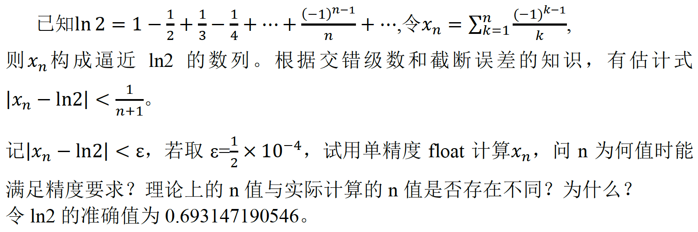
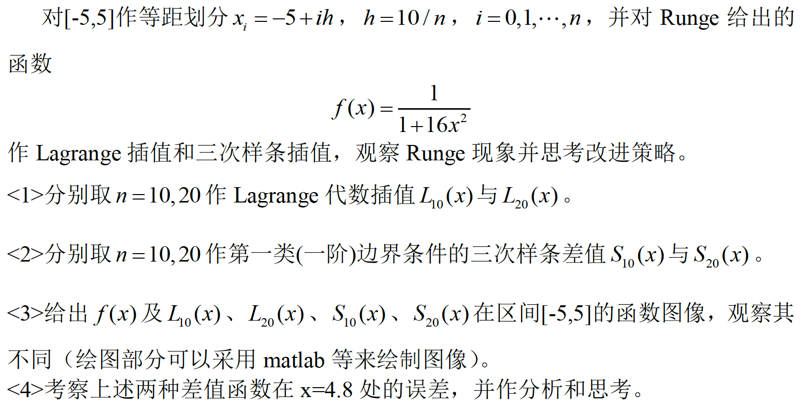

#  实验1 误差与插值法

## 题目1

###  实验要求

### 算法描述

从0开始不断循环计算部分和$x_n$，直到部分和与“准确值”偏差的绝对值小于指定值$\varepsilon$。循环途中记录循环次数$n$。

### 程序清单

* `error.cpp`：主要实验代码

### 运行结果

完整输出结果请见`error.txt`。

*实验值*

使用`float`类型计算，直到$n=9013$时，才有第一次$|x_n - \ln 2| \lt\varepsilon$。

*理论值*

由于有估计式，

$$|x_n - \ln 2| \lt \frac{1}{n + 1}$$

为了使得，

$$|x_n - \ln 2| \lt \varepsilon$$

可以令，

$$\frac{1}{n + 1} \lt \varepsilon$$

于是，

$$n \gt \frac{1}{\varepsilon} - 1 = 19999$$

得到

$$n \ge 20000$$

*讨论*

实验值要比理论值小，这可能是由于计算理论值所使用的估计式给出的误差限太松（大）。

此外，我还尝试使用`double`计算，得到$n=9999$，所以另一个原因可能是，用`float`计算的误差导致计算结果提前与“准确值”偏差的绝对值小于$\varepsilon$。

### 体会与展望

从C++的角度来看，这个实验的代码十分简单；但是从《数值分析》的角度看，这个题目体现出了误差的概念，这一概念是该课程的核心概念之一。以此作为《数值分析》实验的开始，希望之后的实验不但能使我加深对本课程理论知识的理解，而且能锻炼我使用C++实际编写数值计算程序的能力。

## 题目2

### 实验要求

### 算法描述

### 程序清单

- `interpolation.cpp`：主要实验代码

### 运行结果

插值得到的函数图形与教材以及课程上的讲解一致，在$x=4.8$时，Lagrange插值也有巨大误差。

### 体会与展望

