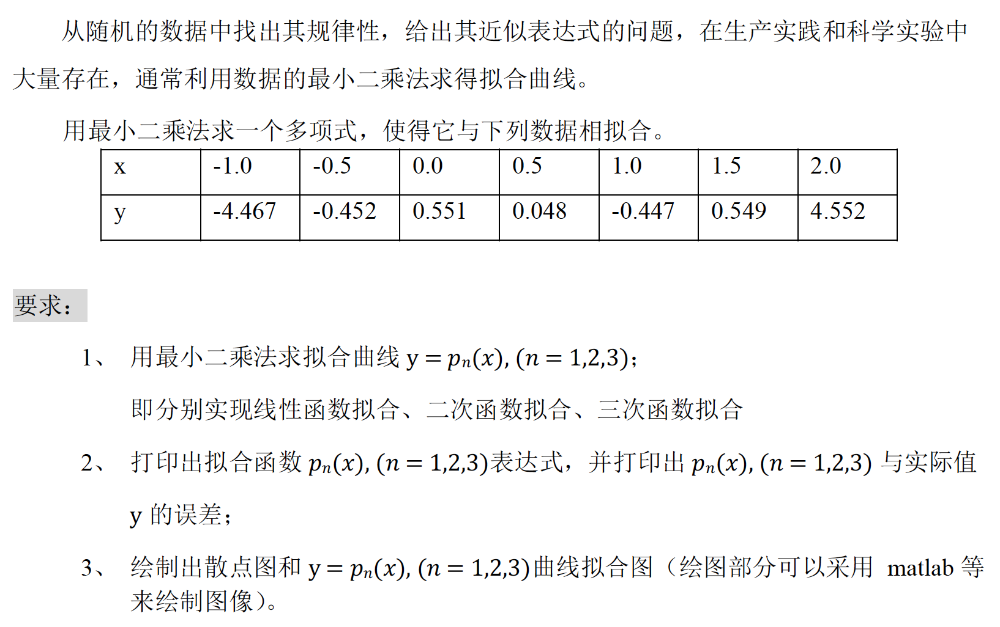
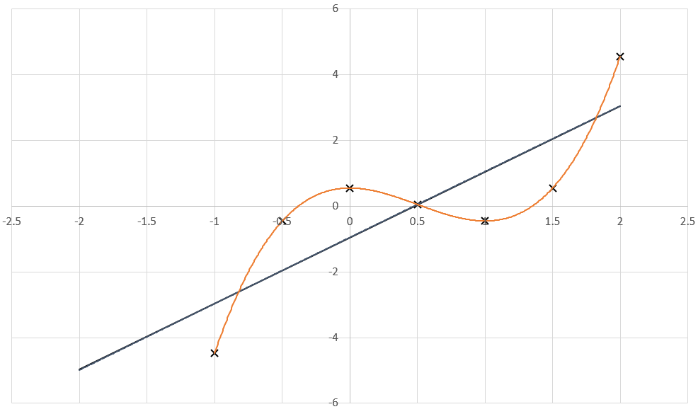

#  实验3 曲线拟合的最小二乘法

## 实验要求



## 算法描述

### 主程序

由于直接解方程作最小二乘法拟合有病态问题，数值稳定性差，所以这里使用正交多项式的办法。

算法首先计算0-3次正交多项式$P_i(x), i = 0, 1, 2, 3$作为基。

然后，利用正交基与数据点作内积，即计算$\alpha^*_i = (P_i, f), i = 0, 1, 2, 3$，立即得到组合系数$\alpha^*_i$，再将正交基进行线性组合，就可以得到拟合函数$p_1(x)、p_2(x)、p_3(x)$，然后输出。

其中，$p_i(x) = \sum_{j=0}^i \alpha^*_j P_j(x), i = 1, 2, 3$；$f(x)$是数据点的函数，$f(x_i) = y_i, i = 1, 2, \dots, 7$

之后，对于每一个数据点的自变量$x_i$，分别输出拟合函数得到的$p_1(x_i)、p_2(x_i)、p_3(x_i)$，以及它们与数据点因变量$y_i$的误差值。

### 内积的计算

内积的计算是在数据点的自变量$x_i$意义下的，利用如下公式计算：

$$ (f, g) = \sum^n_{i=1} f(x_i) g(x_i)$$

### 正交基的求解

利用如下公式即可迭代求解正交基：
$$
P_0(x) = 1 \\
\alpha_1 = (xP_0, P_0) \\
P_1(x) = x - \alpha_1 \\
\alpha_i = \frac{(xP_{i-1}, P_{i-1})}{(P_{i-1}, P_{i-1})} \\
\beta_i = \frac{(P_{i-1}, P_{i-1})}{(P_{i-2}, P_{i-2})} \\
P_i(x) = (x - \alpha_i)P_{i-1}(x) - \beta_i P_{i-2}(x) \\
i = 2, 3
$$

## 程序清单

- `fitting.cpp`：主要实验代码

## 运行结果

完整输出结果请见`out.txt`。

程序输出结果为：

```
Bases:
1.00000000000000000000
x - 0.50000000000000000000
x^2 - x - 0.75000000000000000000
x^3 - 1.50000000000000000000x^2 - x + 0.75000000000000000000

n = 0
pn = 0.04771428571428578500
...

n = 1
pn = 2.00435714285714270000x - 0.95446428571428554000
...

n = 2
pn =  - 0.00376190476190462270x^2 + 2.00811904761904710000x - 0.95164285714285712000
...

n = 3
pn = 2.00355555555555530000x^3 - 3.00909523809523720000x^2 + 0.00456349206349182520x + 0.55102380952380925000
...
```

分析输出结果，得知0-3次正交基分别为：

$$P_0(x) = 1$$

$$P_1(x) = x - 0.5$$

$$P_2(x) = x^2 - x - 0.75$$

$$P_3(x) = x^3 - 1.5x^2 - x + 0.75$$

验证两两计算内积，不同的函数的内积为0，说明我的实现正确。

继续分析输出结果，得到拟合结果：

$$ p_1(x) = 2.004357x - 0.9544643 $$

$$ p_2(x) = -0.003761905x^2 + 2.008119x - 0.9516429 $$

$$ p_3(x) = 2.003556x^3 - 3.009095x^2 + 0.004563492x + 0.5510238 $$

继续分析输出结果，得到：

$p_1(x)$与数据点因变量$y_i$的误差值分别为：$1.508179、1.504643、1.505464、0.0002857143、1.496893、1.503071、1.497750$。

$p_2(x)$与数据点因变量$y_i$的误差值分别为：$1.503476、1.504643、1.502643、0.003476190、1.499714、1.503071、1.502452$。

$p_3(x)$与数据点因变量$y_i$的误差值分别为：$0.0008095238、0.001976190、0.00002380952、0.003476190、0.002952381、0.0004047619、0.0002142857$。

可以看出，就此数据而言，次数越高，误差值总体而言越小。

绘制曲线和散点图如图所示。



图中，$\times$为数据点。黑色的曲线为$p_1(x)$，深蓝色的曲线为$p_2(x)$，它们几乎重合。橙色的曲线为$p_3(x)$。可以看出，$p_3(x)$与数据点拟合的非常好。

使用现有拟合软件进行拟合计算，我发现我的程序输出的结果与其一致，说明我的实现正确。

## 体会与展望

TODO

与现有软件对比发现我的计算结果一致后，我获得了成就感，我也能写出函数拟合程序了！