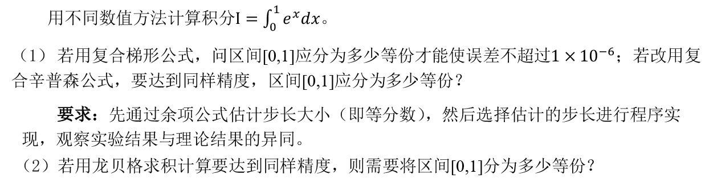
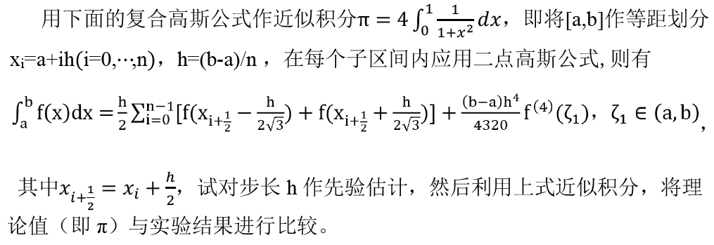

#  实验4 数值积分

## 题目1

###  实验要求



### 算法描述


### 程序清单

* `int.cpp`：主要实验代码

### 运行结果

完整输出结果请见`int.txt`。

#### (1) 复合梯形公式以及复合辛普森公式

**复合梯形公式**


**复合辛普森公式**


#### (2) 龙贝格求积算法

```

```


## 题目2

### 实验要求



### 算法描述


### 程序清单

- `gauss.cpp`：主要实验代码

### 运行结果

完整输出结果请见`gauss.txt`。


### 体会与展望

本次实验我实现并测试了多种数值积分算法，包括复合梯形公式、复合辛普森公式、龙贝格求积算法以及复合高斯公式。TODO

