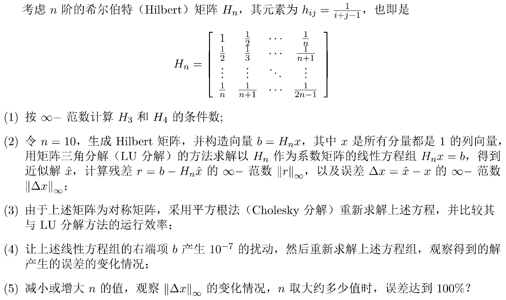

#  实验5 线性方程组的直接解法

## 实验要求

## 算法描述

### LU分解算法

TODO

### 用LU分解结果求解方程组

### 矩阵求逆算法

由于已经实现方程组求解算法，可以利用它来求解矩阵的逆。

只需要求解n个方程组：
$$
\mathbf{A}\mathbf{x}_i=\mathbf{\alpha}_i \\
\mathbf{\alpha}_i=(0~0\cdots0~1~0 \cdots0)^T，其中第i项为1，其余为0 \\
i = 1, 2, \dots, n
$$
将解拼起来，即得：
$$
\mathbf{A}^{-1} = (\mathbf{x}_1~\mathbf{x}_2\cdots\mathbf{x}_n)
$$

### $\infty$-范数计算

用定义式计算即可。

### 条件数计算

用定义式${\rm cond}(A)_\infty=||A^{-1}||_\infty\cdot||A||_\infty$计算，范数以及矩阵求逆算法见上。

### Cholesky分解

### 用Cholesky分解结果求解方程组

## 程序清单

- `solve.cpp`：主要实验代码

## 运行结果

完整输出结果请见`out.txt`。

注：本次实现使用`long double`来提高精度。

### (1)

运行条件数算法，得到：

$${\rm cond}(H_3)_\infty=748$$

$${\rm cond}(H_4)_\infty=28375$$

### (2)

运行条件数算法，得到：

$${\rm cond}(H_{10})_\infty \approx 3.535743\times 10^{13}$$

用$H_{10}\mathbf{x}=\mathbf{b}$生成右端项$\mathbf{b}$，其中$\mathbf{x} = (1~1~1~1~1~1~1~1~1~1)^T$，得到：
$$
\mathbf{b}= \left[ \begin{matrix}
2.92896825396825380000 \\
2.01987734487734500000 \\
1.60321067821067830000 \\
1.34680042180042170000 \\
1.16822899322899330000 \\
1.03489565989565980000 \\
0.93072899322899327000 \\
0.84669537978361509000 \\
0.77725093533917067000 \\
0.71877140317542798000 \\
\end{matrix}
\right]
$$

然后，运行解方程算法，就可以得到解：
$$
\mathbf{\hat x}= \left[ \begin{matrix}
1.00000000000091570000 \\
0.99999999992245125000 \\
1.00000000162908420000 \\
0.99999998533745738000 \\
1.00000006941285190000 \\
0.99999981029575524000 \\
1.00000030980466260000 \\
0.99999970173574293000 \\
1.00000015609990770000 \\
0.99999996576059014000 \\
\end{matrix}
\right]
$$

计算$||\mathbf{r}||_\infty \approx 1.084202 \times 10^{-19}$，不是很大，$||\Delta \mathbf{x}||_\infty \approx 3.098047 \times 10^{-7}$，也不是很大，但是与$||\mathbf{r}||_\infty$相比，相比之下大很多。

### (3)

用Cholesky算法分解矩阵，然后求解同样的方程组，发现解一致，说明实现大致正确。然后，进行性能测试。

为了放大变化，取$n=100$进行测试，测试重复10000次，取平均运行时间。

### (4)

将右端项$\mathbf{b}$的第7项增加$10^{-7}$，重新运行解方程算法，得到解：
$$
\mathbf{\hat x}_1= \left[ \begin{matrix}
1.96095987932409900000 \\
-82.24314957651773700000 \\
1776.85385803321040000000 \\
-16159.27011044255400000000 \\
77129.56189803827100000000 \\
-212102.54523278118000000000 \\
348068.35629358795000000000 \\
-336396.45951701817000000000 \\
176609.66624927238000000000 \\
-38836.55392090855500000000 \\
\end{matrix}
\right]
$$
可以看出解发生了巨大的变化，再次计算$||\mathbf{r}_1||_\infty \approx 3.908332 \times 10^{-15}$，不是很大，但$||\Delta \mathbf{x}_1||_\infty \approx 348067.4$，相当大。

### (5)

从$n=1$开始，直到$||\Delta \mathbf{x}||_\infty \ge 100\% \times ||\mathbf{x}||_\infty=1$，得到$n=14$时，有$||\Delta \mathbf{x}||_\infty \approx 0.3985519$，且$n=15$时，有$||\Delta \mathbf{x}||_\infty \approx 38.20117$。

## 体会与展望

体会了条件数的实际意义，深刻感受到条件数大的矩阵（比如$H_{10}$）求解起来很麻烦：右端项微小的变动竟然能引起解的如此巨大的变化。
