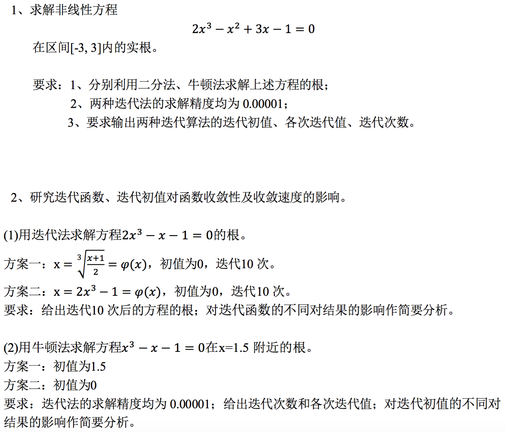

#  实验7 非线性方程求根

## 实验要求

## 算法描述

### 二分法

给定求解精度$\varepsilon$、函数$f(x)$以及求解区间$[l, r]$，二分法如下运行。

1. 输出当前迭代次数，输出起始的$[l, r]$以及$f(l)$、$f(r)$。
2. 若$|r - l| = r - l \le \varepsilon$，算法结束，近似解为$\frac{l + r}{2}$。
3. 计算区间中点$m = \frac{l + r}{2}$以及中点的函数值$f(m)$。
4. 若$f(l) \cdot f(m) \lt 0$，说明解在$[l, m]$，令新的求解区间为$[l, m]$（即令$r = m$）；否则，说明解可能在$[m, r]$，令新的求解区间为$[m, r]$（即令$l = m$）。然后，重新计算$f(l)$以及$f(r)$。
5. 输出当前迭代次数，输出最新的$[l, r]$以及$f(l)$、$f(r)$。
6. 从2.循环执行。

### 牛顿法

给定求解精度$\varepsilon$、函数$f(x)$及其导数$f'(x)$以及初始猜测解$x_0$，牛顿法如下运行。

1. 令当前近似解$x = x_0$，计算$f(x)$、$f'(x)$，以及$\delta = \frac{f(x)}{f'(x)}$。输出当前迭代次数，输出$x$、$f(x)$、$f'(x)$。
2. 若$|\delta| \lt \varepsilon$，算法结束，近似解为$x$。
3. 更新近似解$x = x - \delta$，计算新的$f(x)$、$f'(x)$，以及$\delta = \frac{f(x)}{f'(x)}$。
4. 输出当前迭代次数，输出$x$、$f(x)$、$f'(x)$。
5. 从2.循环执行。

### 迭代法

给定迭代次数、迭代函数$\varphi(x)$以及初始猜测解$x_0$，迭代法如下运行。

1. 设置$x = x_0$。
2. 执行指定次数：$x = \varphi(x)$。
3. $x=\varphi(\varphi(\dots \varphi(x_0) \dots))$为近似解。

## 程序清单

- `solve.cpp`：主要实验代码

## 运行结果

完整输出结果请见`out.txt`。

### 第一题

从程序输出可以知道，用二分法求得的近似解为$0.34563$，迭代次数为$20$次；用牛顿法求得的近似解为$0.34563$，迭代次数为$3$次。二分法和牛顿法得到的解，在精度$\varepsilon=10^{-5}$的情况下，是相同的，并且牛顿法迭代次数更少。

同时，将算法执行过程中得到的未经舍入的近似解代回方程左边的函数，可以看出牛顿法得到的近似解更接近精确解（函数值更接近0）。完整输出结果请见`out.txt`。

### 第二题

#### （1）迭代函数对于收敛情况的影响

容易看出，此方程有一精确解为$x^*=1$。

将程序输出绘制为如下表格：

| 迭代次数 | 方案一          | 方案二                          |
| -------- | --------------- | ------------------------------- |
| 0        | $0$             | $0$                             |
| 1        | $0.79370052598$ | $-1$                            |
| 2        | $0.96436175789$ | $-3$                            |
| 3        | $0.99402465940$ | $-55$                           |
| 4        | $0.99900311645$ | $-332751$                       |
| 5        | $0.99983382513$ | $-7.3686529681 \times 10^{16}$  |
| 6        | $0.99997230342$ | $-8.0019218665 \times 10^{50}$  |
| 7        | $0.99999538388$ | $-1.0247381741 \times 10^{153}$ |
| 8        | $0.99999923065$ | 超出`double`可表示范围          |
| 9        | $0.99999987177$ | 超出`double`可表示范围          |
| 10       | $0.99999997863$ | 超出`double`可表示范围          |

可以看出，方案一得到的解有收敛到精确解的趋势，而方案二得到的解有变为负无穷大的趋势，理论分析如下。

*方案一*

此方案的迭代函数为$\varphi(x) = \sqrt[3]{\frac{x+1}{2}}$，$\varphi'(x) = \frac{1}{3} \cdot \frac{1}{(\frac{x+1}{2})^{\frac{2}{3}}} \cdot \frac{1}{2} = \frac{1}{6} \cdot (\frac{2}{x+1})^{\frac{2}{3}}$。

于是，$|\varphi'(x^*)| = \frac{1}{6} \lt 1$，可以知道该迭代方案有局部收敛性。

*方案二*

此方案的迭代函数为$\varphi(x) = 2x^3 - 1$，$\varphi'(x) = 6x^2$。

于是，$|\varphi'(x^*)| = 6 \gt 1$，可以知道该迭代方案不一定有局部收敛性。

理论分析和实验结果符合得很好，这个例子告诉我们，如果迭代函数选择的不好（$|\varphi'(x^*)| \gt 1$），那么收敛性将无法得到保证。

#### （2）迭代初值对于收敛情况的影响

在精度要求$\varepsilon=10^{-5}$的情况下，同样运行牛顿法，在初值为$1.5$时，迭代$3$次即可达到精度要求；但在初值为$0$时，迭代$20$次才能达到精度要求，虽然此时也能够慢慢收敛到精确解，但在最初几次迭代过程中，近似解在向远离精确解的方向变化。

这个例子告诉我们，如果运气较差，迭代初值选得不好，那么可能要迭代更多次才能收敛到比较好的解，甚至有可能无法收敛。

完整输出结果请见`out.txt`。

## 体会与展望

这一次实验是关于非线性方程的求解，以及对于迭代法，讨论迭代函数和迭代初值的影响。通常，一个复杂函数的解析解十分难求，甚至它没有解析解，而通过二分法或迭代法，特别是牛顿法，可以在几次迭代之内就得到一个精度很好的数值解。可以看出，掌握牛顿法等非线性方程的数值解法对于今后的应用是十分重要的。