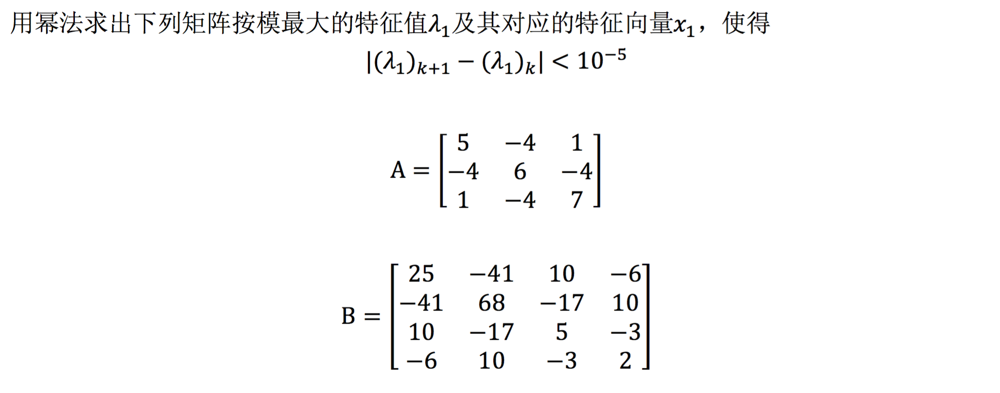

#  实验8 矩阵特征值计算

## 实验要求

## 算法描述

### 幂法

给定一个矩阵$A​$，下面是计算其模最大特征值以及对应特征向量的算法——幂法。

1. 取初始向量$\mathbf{v_0} = \mathbf{u_0} = (1~1~1)^T$
2. $\mathbf{v_1} = A\mathbf{u_0}, \mathbf{u_1} = \frac{\mathbf{v_1}}{\max\{\mathbf{v_1}\}}, \lambda_1 = \max\{\mathbf{v_1}\}$，迭代次数计数器$i = 1$
3. $i = i + 1$
4. $\mathbf{v_i} = A\mathbf{u_{i-1}}, \mathbf{u_i} = \frac{\mathbf{v_i}}{\max\{\mathbf{v_i}\}}, \lambda_i = \max\{\mathbf{v_i}\}$
5. 若$|\lambda_i - \lambda_{i-1}| \lt \varepsilon$，算法结束，此时，$\lambda_i$为模最大特征值，$\mathbf{u_i}$为对应的特征向量（经过规格化）；否则，回到3. 继续运行。

其中，$\max \{\mathbf{v}\}$定义为$\mathbf{v}$中模最大的分量的分量值。

注：实现时，$\mathbf{v_i}$以及$\mathbf{u_i}$事实上可以共用同一个空间存储。

## 程序清单

- `eigenvalues.cpp`：主要实验代码

## 运行结果

完整输出结果请见`out.txt`。

*矩阵$A$*

迭代$14$次后满足精度$\varepsilon = 10^{-5}$要求。

模最大特征值为$\lambda_1 = 12.25432$，对应的特征向量为：
$$
\mathbf{x_1}= \left[ \begin{matrix}
-0.67402 \\
1.00000 \\
-0.88956
\end{matrix}
\right]
$$
*矩阵$B$*

迭代$4$次后满足精度$\varepsilon = 10^{-5}$要求。

模最大特征值为$\lambda_1 = 98.52170$，对应的特征向量为：
$$
\mathbf{x_1}= \left[ \begin{matrix}
-0.60397 \\
1.00000 \\ 
-0.25114 \\
0.14895
\end{matrix}
\right]
$$

## 体会与展望

本次实验实现了用幂法求矩阵的模最大的特征值及对应的特征向量。我们知道，求矩阵的特征值自古以来就是一个老大难问题，而幂法的算法形式很简单，并且能够方便地求出模最大的特征值，甚至可以同时求出对应的特征向量。这次实验让我深刻感受到数值方法威力之大，同时让我进一步体会了《数值分析》课程的实用性以及趣味性。在我今后的学习和科研生活中，《数值分析》课程一定能够助我一臂之力。